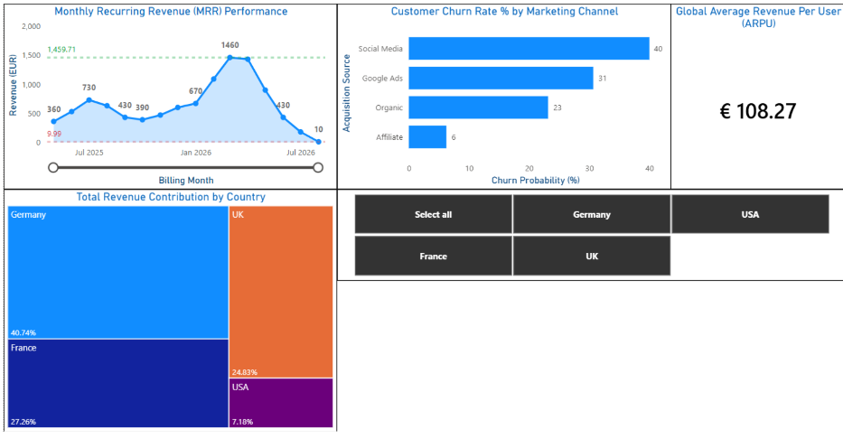

# SaaS Data Pipeline: Revenue & Customer Retention Dashboard

## Project Overview
This project demonstrates a full-scale data pipeline for a subscription-based (SaaS) business. I simulated a "messy" real-world dataset, built an automated SQL cleaning layer, and designed an interactive Power BI dashboard to extract business-critical KPIs.

## Tech Stack
* **Database:** PostgreSQL 
* **ETL/SQL Tool:** DBeaver 
* **Visualization:** Power BI 

## The "Dirty Data" Challenge & Solutions
Real-world data is rarely clean. I intentionally injected errors to demonstrate my engineering skills:
* **Deduplication:** Identified 15 "double-billing" errors using `ROW_NUMBER()` window functions to ensure revenue wasn't overstated.
* **Standardization:** Mapped inconsistent country names (e.g., 'DE', 'Deutschland') into a single 'Germany' label using `CASE WHEN` logic.
* **Refactoring:** Overcame a "Static View" hurdle by refactoring SQL code to inject geographic dimensions, allowing the Power BI slicer to work across all charts.

## Key Business Insights
* **Global ARPU:** The average revenue per user stands at **€108.27**.
* **Churn Red Flag:** Social Media (40%) and Google Ads (31%) are the highest churn risks, while Affiliate leads are the most loyal (6%).
* **Top Market:** **Germany** is the primary revenue driver, contributing **40.74%** of total revenue.

## How to Use
1. Run `01_Data_Generation.sql` to setup the database.
2. Run `02_cleaning_and_views.sql` to clean and aggregate the data.
3. Open the `saas_analysis.pbix` file to view the interactive dashboard.

